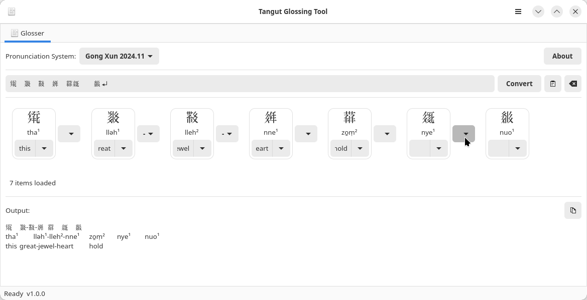

[English](#english) [简体中文](#chinese)

#  Tangut Tools: Resources and Tools for Tangut Language Study

This repository provides tools and resources for the study of the Tangut language, script, and text corpus.  Developed by Xun Gong (University of Vienna) and collaborators.

## Overview

This repository contains the following components:

*   **TgtOrtho - Tangut Orthography Library:** A Python library based on finite state transducers (FSTs) for processing different Latin-script Tangut transcription (reconstruction) systems and their corresponding phonological representations. [Learn more](tgtortho/README.md)
*   **"Tangut Tool" GUI (Python/GTK4):** A prototype graphical user interface for dynamic transcription and glossing of Tangut text. [Learn more](tangut-tool/README.md)
*   ~~**Proof-of-Concept Phonological Reconstruction Tool:**~~ An experimental tool for interpretable and transparent reconstruction of Tangut phonology based on the internal structure of *Sea of Characters*.~~

## **Licensing**  

- **Code:** The code in this repository is licensed under the **MIT License**. You are free to use, modify, and distribute it, provided that you include the original copyright notice.  

- **Data:** The data in this repository is provisionally provided under a **Limited Public Use** license. See [LICENSE-DATA.md](LICENSE-DATA.md) for full details. Key terms:  

  - **Free for Research, Teaching, Publication, and Commercial Use** – You may use and cite **individual** data points in academic research, teaching, and publications, whether in a personal, educational, or business setting. **Internal bulk processing is permitted** as long as the processed results are **not publicly distributed at scale**.

* **Contact:** Please contact Xun Gong (xun.gong@univie.ac.at) for licencing permission.

## Contributing

Contributions and feedback are very welcome\!  We encourage participation from the research community.

**Ways to Contribute:**

  * **Bug Reports:**  If you find any bugs, please open an issue on the GitHub repository.
  * **Feature Requests:**  Suggest new features or improvements by opening an issue.
  * **Code Contributions:**
    1.  Fork the repository.
    2.  Create a new branch for your changes (e.g., `git checkout -b feature/new-functionality`).
    3.  Commit your changes with clear and descriptive commit messages.
    4.  Open a pull request, explaining your modifications.
  * **Data Corrections:** If you find errors or inconsistencies in the data, please open an issue or submit a pull request with corrections.

## Contact

For questions, permission requests, or collaboration opportunities, please contact:

  * **Xun Gong**
  * **University of Vienna**
  * **Email:** xun.gong@univie.ac.at

#  西夏文研究工具

本GitHub仓库提供西夏语言、文字及文本研究相关工具与资源，由龚勋（维也纳大学）及合作者开发。

## 概述

本项目包含以下组件：

- **TgtOrtho - 西夏文拟音处理库**  
  基于有限状态转换器（FST）的Python库，用于处理不同拉丁字母西夏文拟音系统及其对应的音系表示。[详细信息](tgtortho/README.md)

- **西夏文处理工具**  
  利用 Python/GTK4 开发的原型系统，支持西夏文本的自动标音与辅助标意。[详细信息](tangut-tool/README.md)

- ~~**音韵构拟工具**~~  
  基于《文海》的结构特征开发的透明、可解释音韵构拟工具，目前处于试验阶段。

## 授权

- **代码部分**：本项目代码采用 **MIT 许可证** 开源。您可以自由使用、修改及分发，但请务必保留原始版权声明。

- **数据部分**：本项目数据部分暂时按照 **有限公共使用许可协议** 公开，完整条款详见 [LICENSE-DATA.md](LICENSE-DATA.md) ，主要规定如下：
  - **研究、教学、出版及商业应用均可免费使用**：学术研究、教学、出版及商业场景下的 **具体数据** 引用与使用。**允许内部批量处理**，但请确保处理结果不得整体性公开传播。
  - 如需进一步使用许可，请联系龚勋（xun.gong@univie.ac.at）。

## 参与

欢迎广大爱好者朋友与学界同仁通过以下方式参与项目共建：
- **问题反馈**：如发现任何问题，请在 GitHub 上提交 issue。
- **功能建议**：如有新功能讨论，欢迎提出 issue。
- **代码贡献**：
  1. Fork 本项目；  
  2. 创建新分支进行开发（例如：`git checkout -b feature/new-functionality`）；  
  3. 编写清晰明了的commit说明；  
  4. 发起pull request，说明您的修改内容。
- **数据校订**：如发现数据错误或其他问题，欢迎提交 issue 或直接通过 pull request 提交修正方案。

## 联系方式

如需咨询授权事宜、学术合作或提供建议，请联系：
- **龚勋**  
- **维也纳大学**  
- **邮箱**：xun.gong@univie.ac.at
